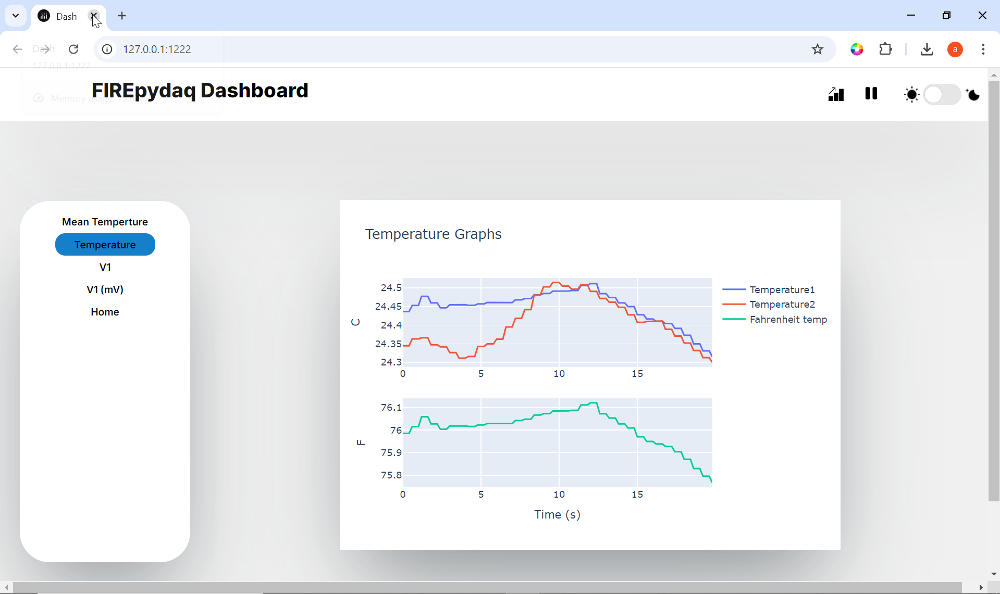

<p align="center">
  
</p> 

<div align="center">

<!-- Releases -->


<!-- Workflows -->
[](https://github.com/ulfsri/firepydaq/actions/workflows/RunPytest.yml)
[](https://github.com/ulfsri/firepydaq/actions/workflows/MakeExe.yml)
[](https://github.com/ulfsri/firepydaq/actions/workflows/BuildDists.yml)


<!-- Followers and usage -->


</div>

# FIREpyDAQ

FIREpyDAQ is a python based Facilitated Interface for Recording Experiments (FIRE), for devices that are generally used for data acquisition in engineering research. The device list and general requirements are given below.

## Installation

Using `pip`, you can install this package. `pip` will also install relevant dependencies.

```bash
$ pip install firepydaq
```
## Hardware/Communication Requirements

This interface can be used for three types of devices simultaneously,

- NI hardware, which requires installation of <a href="https://www.ni.com/en/support/downloads/drivers/download.ni-daq-mx.html#532710" target="_blank">NI-DAQmx driver</a> from National Instruments.
	- This has been built so far only for Analog Input and Output data.
- Alicat Mass Flow Controllers and Mass Flow Meter, which is based via serial communication and python API available from <a href="https://github.com/numat/alicat" target="_blank">Numat</a>.
- Thorlabs CLD101X, which is based on serial communication

## Usage

**A brief usage is provided below. Please refer to the documentation for additional details.**

`firepydaq` can be compiled by using one of the following scripts.

```python
# On Windows: Protect your script from importing child processes
# Required if you need dashboard access.
# Dashboard is spawned as a separate process. 
if __name__ == "__main__":
    from firepydaq.FIREpyDAQ_Acquisition import FIREpyDAQ_Acquisition
    FIREpyDAQ_Acquisition()

```

Alternatively, you can run the following.
 
```python
# On Windows: Protect your script from importing child processes 
# Required if you need dashboard access.
# Dashboard is spawned as a separate process. 
if __name__ == "__main__":
	import multiprocessing as mp
	mp.freeze_support()
	from firepydaq.acquisition.acquisition import application
	import sys
	from PySide6.QTWidgets import QApplication

	app = QApplication(sys.argv)
	main_app = application()
	main_app.show()
	sys.exit(app.exec())
```

Example usage is given in the following video. The corresponding files and snapshots are provided after the video for reference.


Example of NI config that is required to set-up the acquisition. You can formulate your own config file. You can use the `NISYSCheck.py` utility to get information of the connected NI device.

|**\#**| **Panel** | **Device** | **Channel** | **ScaleMax** | **ScaleMin** | **Label** | **Type**     | **TCType**   | **Chart** | **AIRangeMin** | **AIRangeMax** | **Layout** | **Position** | **Processed\_Unit** | **Legend** |
|-----------|------------|-------------|--------------|--------------|-----------|--------------|--------------|-----------|----------------|----------------|------------|--------------|--------------------|------------|--------------|
| 0         | 1          | cDAQ1Mod1   | ai0          | 1            | 1         | Temperature1 | Thermocouple | K         | Temperature    | 1              | 1          | 2            | 1                  | C          | Temperature1 |
| 1         | 1          | cDAQ1Mod1   | ai2          | 1            | 1         | Temperature2 | Thermocouple | K         | Temperature    | 1              | 1          | 2            | 1                  | C          | Temperature2 |
| 2         | 1          | cDAQ1Mod3   | ai0          | 1            | 0         | Voltage1     | Voltage      | NA        | V1             | 0              | 1          | 1            | 1                  | V          | Open V1      |
| 3         | 1          | cDAQ1Mod3   | ai2          | 1            | 0         | Voltage2     | Voltage      | NA        | None           | 0              | 1          | 1            | 1                  | C          | Open V2      |


Example of Formulae file that is used to post-process data is display in dashboard is selected.

| **Label** | **RHS**                            | **Chart**       | **Legend**      | **Layout** | **Position** | **Processed\_Unit** |
|-----------|------------------------------------|-----------------|-----------------|------------|--------------|--------------------|
| TF_mult   | 9/5                                | None            | TF_mult         | 1          | 1            | -                  |
| TF_offset | 32                                 | Constant        | TF_mult         | 1          | 1            | -                  |
| Temp_F    | (Temperature1)*TF_mult + TF_offset | Temperature     | Fahrenheit temp | 2          | 2            | F                  |
| T_mean    | (Temperature1 + Temperature2)/2    | Mean Temperture | Mean Temp       | 1          | 1            | C                  |
| V_mA      | Voltage1/1000                      | V1 (mV)         | Volts           | 1          | 1            | mA                 |

Example of Acquisition interface during acquisition:


Example of how the dashboard looks like during acquisition:


## Contributing

Interested in contributing? Check out the [contributing guidelines](CONTRIBUTING.md). 
Please note that this project is released with a Code of Conduct. 
By contributing to this project, you agree to abide by its terms.

Suggested procedure is given below. Note: Pull request into the `main` branch will not be accepted.

- Fork this repository.
- Create a `your_feature` branch from the `dev` branch. 
- Clone your repository on your machine.
- Install poetry using `pipx` as recommended or using `pip`, and `make` (optional). 
- If you install and configure `make` - run `make build`, which will initiate the commands `poetry build`, `poetry lock`, and `poetry install` in succession. This will create a virtual environment for testing your developments.
- Alternatively (without `make`), you can run individual `poetry` commands to install the package on a virtual environment (ideal) for local development.
- Make your edits, and send a PR following the template. 

## License

`firepydaq` was created by Dushyant M. Chaudhari. It is licensed under the terms
of the GNU General Public license, v.3.0.

## Citation

Full citation:
```{note}

Chaudhari, D. M., Mishra, A., (2024). Facilitated interface for recording experiments - a python-based data acquisition program. In Github Repository. Fire Safety Research Institute, UL Research Institutes; Github. https://github.com/ulfsri/firepydaq

```

Bib:
```
@misc{firepydaq,
title={Facilitated Interface for Recording Experiments - A python-package for data acquisition.},
howpublished = {Fire Safety Research Institute, UL Research Institutes},
url = {https://github.com/ulfsri/firepydaq},
author = {Dushyant M. Chaudhari, Anvii Mishra},
publisher = {Github},
journal = {Github Repository},
year = {2024}
}
```

## Acknowledgements

Thanks to the following community guidelines which were immensely helpful while making this package.

- <a href="https://py-pkgs.org/welcome" target="_blank">py-pkgs</a>
- <a href="https://coderefinery.github.io/documentation/" target="_blank">Code refinery documentation</a>
- <a href="https://www.sphinx-doc.org/en/master/usage/index.html" target="_blank">Sphinx documentation</a>
- <a href="https://sphinx-autoapi.readthedocs.io/en/latest/" target="_blank">Sphinx AutoAPI documentation</a>
- <a href="https://numpydoc.readthedocs.io/en/latest/format.html" target="_blank">Numpy docstrings style guide</a>
- <a href="https://packaging.python.org/en/latest/" target="_blank">Python packaging guide</a>
- <a href="https://www.pythonguis.com/pyside6/" target="_blank">PythonGUIs, by Martin FitzPatrick</a>

Additionally, the contributors are grateful for the support from [Fire Safety Research Institute](fsri.org), a part of [UL Research Institutes](ul.org), for this project.

